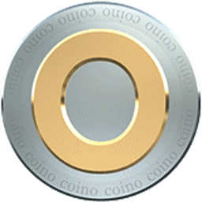

  

<h1 align="center">CoinoCore</h1>

  <strong>Official repository for the Coino (CNO) cryptocurrency wallet</strong>

---

## 📦 Versions

| Version | Status | Description |
|---|---|---|
| **V3** | ✅ **Current** | Coino CNO v2.0.0.2 — stable release |
| **V4** | 🔧 **In development** | Next generation |

---

## 🚀 CoinoCore V3

**Current release:** [`v3.0.0`](../../releases/tag/v3.0.0)

### What's new
- ✅ **libsecp256k1** replaces OpenSSL ECDSA
- ✅ **OpenSSL 3.x** compatibility via `OPENSSL_API_COMPAT`
- ✅ **Version** `CNO-v2.0.0.2`
- ✅ **Fixed** the sync stall at block **395 740**
- ✅ **Fully synchronized** to block 814 735

### Platforms
- 🐧 Linux x86_64

### Download
See [Releases](../../releases/tag/v3.0.0)

### Build
See [V3/BUILD.md](V3/BUILD.md)

---

## 🔧 CoinoCore V4

**Status:** 🔧 In development

See [V4/README.md](V4/README.md)

---

## 📚 Documentation

- [ROADMAP.md](ROADMAP.md) — release roadmap
- [V3/BUILD.md](V3/BUILD.md) — build instructions for V3
- [V4/README.md](V4/README.md) — V4 roadmap

---

## 🤝 Contributing

Pull requests are welcome. For major changes, please open an issue first.

---

## 📜 License

MIT — see [LICENSE](LICENSE)

---

**Author:** CoinoCore Team  
**Date:** 2026
